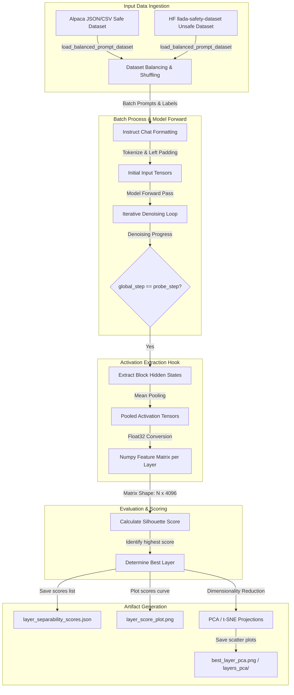

# Repository Workflow Overview

This repository provides an experimental pipeline to study the geometric and representation dynamics of diffusion-based Large Language Models (dLLMs) under safe versus adversarial (unsafe) prompting conditions. Specifically, the framework analyzes the **LLaDA-8B-Instruct** model's internal activations across different transformer layers and at various decoding (denoising) steps.

The primary research objective is to investigate the **separability** of safe and unsafe prompts within the latent space of the model during its generative denoising process. By extracting internal hidden states and evaluating how well they form distinct clusters, researchers can identify:
1. **Where** in the transformer layers (layer-wise dimension) safe and unsafe representations diverge.
2. **When** in the generative process (decoding-step dimension) the model registers the adversarial nature of a prompt.

This analysis lays the groundwork for real-time safety monitoring (e.g., stopping jailbreak generations early in the denoising trajectory) by mapping high-dimensional activation trajectories into lower-dimensional manifolds and monitoring deviation boundaries.

---

# Experimental Pipeline

The experimental workflow is designed to run in two configurations:
1. **Single-Step Probing:** Run analysis for a single, specific decoding step and evaluate the safe/unsafe separability across all transformer layers.
2. **Multi-Step Probing Sweep:** Sweep across multiple decoding steps to track how the optimal layer and classification boundaries evolve over time.

### Pipeline Ingestion and Orchestration Flow

1. **Orchestration Script (`run_probe_steps.sh`):**
   - The shell script sweeps a list of denoising steps specified by the `PROBE_STEPS` environment variable (defaults to `1 5 10 15 20 25 30`).
   - For each step, it runs the primary CLI entry point `probe_analysis.py` with custom parameters (such as the target model, dataset paths, batch sizes, seed, and projection types).
   - Once the sweep completes, it runs an inline Python aggregation block that reads the silhouette scores from each step's output directory, identifies the best layer for each step, and creates a consolidated JSON mapping file (`best_layers.json`).

2. **Analysis Entry Point (`probe_analysis.py`):**
   - Parses configuration arguments via `parse_args()`.
   - Ingests the datasets using `load_balanced_prompt_dataset()` from `dataset.py`.
   - Loads the tokenizers and models via Hugging Face API while ensuring architecture compatibility using helper functions.
   - Triggers the activation extraction sequence via `extract_layer_features()`.
   - Computes clustering metrics via `compute_layer_scores()`.
   - Generates and writes analysis outputs (JSON files, score curve plots, 2D scatter projections) to the directory specified by `--output-dir`.

---

# Dataset Processing

The dataset processing is implemented in `dataset.py` and handles the ingestion, building, and label assignment for safe and unsafe prompts.

### 1. Defining Classes
*   **Safe Prompts (Label `0`):** Prompts representing benign, standard instruction-following requests.
*   **Unsafe Prompts (Label `1`):** Prompts representing adversarial or jailbreak attempts.

### 2. Loading Strategy
The prompt collection is managed by the function `load_balanced_prompt_dataset()`, which performs the following operations:
*   **Safe Prompts Ingestion:**
    - If `--safe-local-path` is provided: Ingests a local dataset (supporting `.json` or `.csv` files) using `_load_local_prompts()`. It shuffles the dataset and extracts the text under the field defined by `--safe-local-field` (defaults to `"Refined_behavior"`). In this repository, the file `AlpacaDIJA/llada_instruct_DIJA_v1.json` is used as the local safe prompt file.
    - If no local path is provided: Downloads the Hugging Face dataset `saralazza/llada-safety-dataset`, filters for rows where `source_dataset == "alpaca"`, shuffles, and extracts the prompts.
    - **Prompt Builder (`_safe_alpaca_prompt()`):** Resolves the target prompt by falling back through: `refined_behavior` $\rightarrow$ `behavior` $\rightarrow$ `instruction` + `input`.
*   **Unsafe Prompts Ingestion:**
    - Always loaded from the safety dataset (loaded via Hugging Face Hub or read from the downloaded cache).
    - Filters for rows where `source_dataset != "alpaca"`.
    - **Prompt Builder (`_unsafe_prompt()`):** Resolves the unsafe prompt text by falling back through: `refined_behavior` $\rightarrow$ `prompt` $\rightarrow$ `behavior` $\rightarrow$ `instruction` + `input`.
*   **Balancing and Shuffling:**
    - Collects exactly `samples_per_class` rows for both groups to maintain a perfectly balanced classification target (default: `50` samples per class).
    - Merges the two sets of prompts with their respective labels: `0` for safe and `1` for unsafe.
    - Shuffles the combined tuples deterministically using a local random number generator `random.Random(seed)` to ensure reproducibility.
*   **Label Validation (`validate_labels()`):**
    - Verifies that the final target label array contains exactly the set `{0, 1}` to prevent runtime errors or single-class failures.

---

# Model Inference Pipeline

The LLaDA model is an iterative diffusion-based language model. Unlike standard autoregressive models that generate text one token at a time from left to right, LLaDA generates text by starting with all mask tokens and predicting vocab distributions in parallel.

### Model Loading & Configuration (`generate.py`)
1. **Weight Tying Compatibility (`install_transformers_tied_weights_compat()`):**
   - LLaDA uses remote model code that relies on tied embedding weights. In newer Hugging Face `transformers` versions, the bookkeeping structures for tied weights changed. This function dynamically backfills `all_tied_weights_keys` and wraps `PreTrainedModel.tie_weights` to ensure the remote-code model loads correctly on CPU or GPU without missing key errors.
2. **Configuration Defaults (`ensure_llada_config_compat()`):**
   - Populates essential LLaDA model config defaults: sets `use_cache = False` (since bidirectional diffusion generation cannot reuse token keys/values in the same way as causal generation) and `use_return_dict = True`.

### Denoising and Generation Flow
During inference, LLaDA carries out generative steps. In the probing pipeline, the generation is executed using the custom function `generate_with_layer_probes()`:
*   **Input Alignment:**
    - The prompt is left-padded. The tokenizer padding side is explicitly set: `tokenizer.padding_side = "left"`.
    - The generated sequence is initialized as a tensor `x` of shape `[batch_size, prompt_len + gen_length]`, where the generated suffix portion is filled with `mask_id` tokens (value `126336`).
    - The prompt attention mask is concatenated with a matrix of ones of shape `[batch_size, gen_length]` to ensure the entire sequence is attended to during generation.
*   **Denoising Loop:**
    - Tracks the denoising process over the specified number of `steps` (default `64`).
    - At each step, a forward pass is run: `_model_forward(model, x, attention_mask=attention_mask)`.
    - Logits are extracted from the output using `_output_logits()`.
    - If classifier-free guidance (`cfg_scale > 0`) is used, the batch size is doubled during the forward pass to evaluate conditional and unconditional paths, and the logits are combined: `logits = un_logits + (cfg_scale + 1) * (logits - un_logits)`.
    - Noise is injected using Gumbel-max sampling (`add_gumbel_noise()`) at the specified `temperature`.
    - Predicts candidate tokens `x0` and evaluates confidence values (`p` or random, depending on `remasking` type).
    - Gradually replaces mask tokens in `x` with the predicted tokens based on the step transition rate calculated by `get_num_transfer_tokens()`.

---

# Activation Extraction

The activation extraction process captures the internal states of the model at a specific point in its reasoning process.

### Hook Injection and Slicing (`generate.py` / `probe_analysis.py`)
1. **Target Step Detection:**
   - The denoising loop in `generate_with_layer_probes()` tracks a `global_step` index.
   - When `global_step == probe_step` (e.g., step 10), the model is instructed to output its hidden states: `output_hidden_states = True` is passed to `_model_forward()`.
2. **Layer Slicing (`_transformer_layer_states()`):**
   - The raw hidden states returned by the model include the initial word embeddings (at index 0) followed by the output states of each transformer block.
   - `_transformer_layer_states()` filters the embeddings and returns a tuple containing exactly the output hidden states for the 32 transformer blocks (indexed from `0` to `31`).
3. **Mean Pooling (`_mean_pool()`):**
   - Hidden states at each block layer have the shape `[batch_size * CFG_factor, sequence_length, hidden_dim]`, where `hidden_dim = 4096`.
   - To construct a single fixed-length representation for the prompt, the hidden states are pooled across the sequence dimension (dim=1).
   - Pooling is performed using the attention mask to exclude padding tokens:
     $$pooled = \frac{\sum_{i=1}^{L} h_i \cdot m_i}{\sum_{i=1}^{L} m_i}$$
     where $h_i$ is the hidden state vector at token index $i$ and $m_i$ is the attention mask value ($0$ or $1$) at index $i$.
4. **CFG Slice and Precision Conversion (`_capture_layer_probes()`):**
   - If classifier-free guidance is active, the batch dimension contains both conditional and unconditional evaluations. The function slices the first `:batch_size` items to extract only the activations corresponding to the conditional prompt.
   - Activations are detached from the gradient graph, cast to standard single-precision floats (`float32`), and moved to the CPU:
     ```python
     pooled.detach().float().cpu()
     ```
   - The results are returned as a dictionary mapping each `"layer_{layer_id}"` to its pooled activation tensor of shape `[batch_size, 4096]`.

---

# Layer-wise Analysis

Once activations are collected, the pipeline evaluates the safety representation separability across each layer in sequence.

```
For each batch:
  Format prompts -> Tokenize -> Run LLaDA to probe_step -> Extract block activations
  
For each Layer L (0 to 31):
  Concatenate pooled batch activations -> Matrix of shape [total_samples, 4096]
  Compute Silhouette Score(Layer Features, Labels)
  
Identify Best Layer = argmax(Silhouette Scores)
Save score curve, best layer projections, and separate plots
```

### Layer Iteration and Tensors
*   **Activation Compilation:**
    - The features for each batch are appended to buffers within `extract_layer_features()`.
    - Once all batches are processed, they are concatenated along the batch axis:
      ```python
      {layer_id: np.concatenate(chunks, axis=0) for layer_id, chunks in layer_buffers.items()}
      ```
    - For a dataset with $N$ total samples (where $N = 2 \times \text{samples\_per\_class}$), this yields a final numpy array for each layer of shape:
      $$\text{Shape: } [N, 4096]$$
*   **Clustering Evaluation:**
    - The silhouette score is computed for each layer array using the labels vector of shape `[N]`.
    - The layer with the highest silhouette score is designated as the `best_layer` (the layer that most clearly separates safe from unsafe prompts at that denoising step).
*   **Result Storage:**
    - Silhouette scores are saved as a JSON dictionary mapping `"layer_id"` $\rightarrow$ `score`.
    - Projections (PCA or t-SNE) are computed on the best layer's features and saved to disk.

---

# Decoding-Step Analysis

The decoding-step analysis tracks how safety separability evolves over time during the diffusion generation process.

### Denoising Step Tracking and Alignment
1. **Selecting Steps:**
   - Denoising steps are selected via `run_probe_steps.sh`. Since LLaDA generates text by removing noise over multiple passes, analyzing the representations at different steps reveals *when* the model detects adversarial patterns.
   - Research shows that early steps (steps 5–15 out of 64) are critical because this is when the model establishes the core semantic direction and structural outline of the response.
2. **Token Position Tracking:**
   - At decoding step $T$, the token sequence contains a mixture of concrete tokens (already generated) and mask tokens (remaining to be generated).
   - Because LLaDA generates tokens in parallel across the sequence rather than left-to-right, the position of concrete tokens varies dynamically.
3. **Alignment Across Prompts:**
   - Since prompts have different lengths, left-padding aligns the sequence boundaries.
   - The attention mask is updated at the beginning of the generation block, ensuring that the mean-pooling function averages over the entire active sequence (prompt + generated tokens) while ignoring padding.
   - This ensures that regardless of prompt length or the number of tokens generated, the extracted feature representation remains a standardized 4096-dimensional vector.
4. **Temporal Trajectory Consolidation & Best Layer Selection:**
   - By running the pipeline over steps such as `1, 5, 10, 15, 20, 25, 30`, the system generates individual output directories for each denoising step (e.g., `layer_analysis_results/10/`).
   - Within each step's output directory, `probe_analysis.py` saves a complete map of all layers to their silhouette scores in `layer_separability_scores.json`.
   - The selection of the best layer for each step is automated by an inline Python aggregation block at the end of `run_probe_steps.sh`:
     ```python
     for step in probe_steps:
       scores_path = os.path.join(out_root, step, 'layer_separability_scores.json')
       if not os.path.exists(scores_path):
         continue
       with open(scores_path, 'r', encoding='utf-8') as fh:
         scores = json.load(fh)
       if not scores:
         continue
       # Select the layer key corresponding to the maximum silhouette score
       best_layer = max(scores.items(), key=lambda kv: kv[1])[0]
       try:
         best_layer = int(best_layer)
       except Exception:
         pass
       results[str(step)] = best_layer
     ```
   - This mapping reads the dictionary `scores` where keys are layer indexes (as strings) and values are float silhouette scores. It executes `max(scores.items(), key=lambda kv: kv[1])` to retrieve the key-value pair with the highest silhouette score, extracts the key, casts it to an integer, and writes the consolidated mapping (`denoising_step -> best_layer`) into `layer_analysis_results/best_layers.json`.


---

# Separability Metrics

The codebase uses three main metrics and dimensionality reduction techniques to analyze and visualize the separability of safe and unsafe prompts:

## 1. Silhouette Score
*   **Mathematical Intuition:**
    Measures how similar an object is to its own cluster (cohesion) compared to other clusters (separation). For a single activation vector $i$, the silhouette score $s(i)$ is defined as:
    $$s(i) = \frac{b(i) - a(i)}{\max(a(i), b(i))}$$
    where:
    - $a(i)$ is the mean Euclidean distance between $i$ and all other points in the same class (safe or unsafe).
    - $b(i)$ is the mean Euclidean distance between $i$ and all points in the nearest cluster of the other class.
    
    The average silhouette score over all samples ranges from $-1$ to $+1$. A score near $+1$ indicates that safe and unsafe activations form distinct, tightly clustered groups. A score near $0$ indicates overlapping classes, and a score near $-1$ indicates incorrect clustering.
*   **Implementation Location:**
    Imported from `sklearn.metrics.silhouette_score` and executed in `probe_analysis.py` within the function `compute_layer_scores()`.
*   **Inputs:**
    - `features`: Numpy array of shape `[N, 4096]` (pooled layer activations).
    - `labels`: Class labels array of shape `[N]` (containing values 0 and 1).
*   **Outputs:**
    - A float value representing the overall silhouette score.
*   **Interpretation:**
    Used to rank all 32 transformer layers. The layer with the highest score is identified as the optimal layer for training downstream classifiers (such as safety classifiers).

## 2. Principal Component Analysis (PCA)
*   **Mathematical Intuition:**
    A linear dimensionality reduction method that projects the 4096-dimensional activation features onto a 2D plane. It computes the eigenvectors of the feature covariance matrix and projects the data along the two directions of maximum variance (PC1 and PC2).
*   **Implementation Location:**
    Executed in `visualization.py` within the function `save_layer_projection()`.
*   **Inputs:**
    - `features`: Activation matrix of shape `[N, 4096]`.
    - `labels`: Class labels array of shape `[N]`.
*   **Outputs:**
    - A 2D scatter plot image mapping the projected coordinates, color-coded by class (blue for safe, red for unsafe).

## 3. t-Distributed Stochastic Neighbor Embedding (t-SNE)
*   **Mathematical Intuition:**
    A non-linear dimensionality reduction technique that maps high-dimensional vectors to a 2D space while preserving local neighborhoods. It minimizes the divergence between probability distributions of pairwise similarities in the high-dimensional and low-dimensional spaces.
    
    The script dynamically configures the perplexity parameter based on the number of samples to prevent optimization errors:
    $$\text{perplexity} = \min\left(30, \max\left(1, \frac{N - 1}{3}\right)\right)$$
*   **Implementation Location:**
    Executed in `visualization.py` within the function `save_layer_projection()`.
*   **Inputs:**
    - `features`: Activation matrix of shape `[N, 4096]`.
    - `labels`: Class labels array of shape `[N]`.
*   **Outputs:**
    - A 2D scatter plot image capturing localized neighborhoods and clustering structures.

---

# Generated Outputs

Running the experiments creates an output directory containing the following artifacts:

| Output File / Pattern | Format | Generation Source | Purpose & Contents |
| :--- | :--- | :--- | :--- |
| `layer_separability_scores.json` | JSON | `probe_analysis.py` $\rightarrow$ `save_scores()` | A JSON file mapping layer IDs (as string keys `"0"` through `"31"`) to their float silhouette scores. |
| `layer_score_plot.png` | PNG image | `probe_analysis.py` $\rightarrow$ `save_layer_score_plot()` | A line plot visualizing the silhouette score (y-axis) across all transformer layers (x-axis) to display where separability peaks. |
| `best_layer_{projection}.png` | PNG image | `probe_analysis.py` $\rightarrow$ `save_best_layer_projection()` | A 2-dimensional scatter plot (PCA or t-SNE) showing safe and unsafe activations for the best-performing layer. |
| `layers_{projection}/` | Directory | `probe_analysis.py` | Contains 2D projection scatter plots for every single layer (e.g., `layer_00_pca.png`, `layer_01_pca.png`) to inspect activation layouts step-by-step. Enabled via `--save-all-layer-projections`. |
| `best_layers.json` | JSON | `run_probe_steps.sh` (Inline Python) | A JSON mapping file that consolidates results across the entire denoising sweep. Maps each `"probe_step"` string to its highest-scoring `"best_layer"` integer. |

---

# Repository Workflow Diagram



---

# Key Source Files

Below is a detailed map of the source files involved in the probing and separability pipeline:

| File Path | Component Name | Key Class / Functions | Description & Role |
| :--- | :--- | :--- | :--- |
| `probe_analysis.py` | Command-Line Entry Point | `main()`, `extract_layer_features()`, `compute_layer_scores()`, `save_scores()` | Main script that parses arguments, orchestrates dataset loading, initiates the feature extraction batches, computes silhouette scores, and outputs metrics. |
| `dataset.py` | Dataset Loader | `load_balanced_prompt_dataset()`, `_load_local_prompts()`, `_safe_alpaca_prompt()`, `_unsafe_prompt()`, `validate_labels()` | Handles downloading and parsing datasets from local JSON/CSV files or Hugging Face. Shuffles and balances safe and unsafe prompts, mapping labels (0/1). |
| `generate.py` | Model Inference Wrapper | `generate_with_layer_probes()`, `_capture_layer_probes()`, `_transformer_layer_states()`, `_mean_pool()` | Wraps the LLaDA model forward loop. Implements the hidden state interception hook, mean-pooling, and CPU offloading. |
| `visualization.py` | Plotting and Projections | `save_layer_score_plot()`, `save_layer_projection()`, `save_best_layer_projection()` | Contains plotting routines using `matplotlib`. Implements `PCA` and `t-SNE` projections and color-codes scatter plots. |
| `run_probe_steps.sh` | Sweep Orchestrator | Bash script | Sweeps through multiple decoding steps, runs `probe_analysis.py` for each step, and runs an inline Python script to aggregate the best layer results. |

---

# Reproducing the Experiments

Use the following step-by-step instructions to reproduce the layer and decoding-step separability experiments from scratch.

### 1. Prerequisites and Setup
*   **Python Version:** Python 3.10 is recommended.
*   **Virtual Environment:**
    ```bash
    python -m venv .venv
    source .venv/bin/activate  # On Windows: .venv\Scripts\activate
    ```
*   **Dependencies:** Install dependencies from `requirements.txt` (includes `torch`, `transformers`, `scikit-learn`, `matplotlib`, and `datasets`):
    ```bash
    pip install -r requirements.txt
    ```
*   **Hardware Requirements:** A GPU with at least 16GB of VRAM is recommended to load the LLaDA-8B-Instruct model in `bfloat16`.

### 2. Running a Single Probing Experiment
To run the analysis for a single denoising step (e.g., extracting activations at step 10 of 64):
```bash
python probe_analysis.py \
  --model-name GSAI-ML/LLaDA-8B-Instruct \
  --safe-local-path AlpacaDIJA/llada_instruct_DIJA_v1.json \
  --safe-local-field Refined_behavior \
  --samples-per-class 50 \
  --batch-size 1 \
  --device cuda \
  --seed 42 \
  --steps 64 \
  --gen-length 64 \
  --block-length 64 \
  --probe-step 10 \
  --projection pca \
  --output-dir probe_outputs/step_10 \
  --save-all-layer-projections
```
*   **Output:** Generates `layer_separability_scores.json`, `layer_score_plot.png`, `best_layer_pca.png`, and the layer-by-layer projections folder `layers_pca/` in `probe_outputs/step_10/`.

### 3. Running a Denoising Step Sweep
To run the full multi-step sweep and extract the trajectory of the best-performing layers:
```bash
# Configure variables (optional)
export PROBE_STEPS="1 5 10 15 20 25 30"
export OUTPUT_ROOT="layer_analysis_results"
export PYTHON="python"
export MODEL_NAME="GSAI-ML/LLaDA-8B-Instruct"

# Run the sweep script
bash run_probe_steps.sh
```
*   **Output:** Creates subdirectories in `layer_analysis_results/` for each step, and creates `layer_analysis_results/best_layers.json` mapping each decoding step to the layer with the highest silhouette score.

---

# Summary

Based directly on the repository code and architecture, we draw the following conclusions:
1. **Safety Class Representation:** The pipeline uses a clean binary classification framework where safe prompts (label 0, from Alpaca sources) and unsafe prompts (label 1, from jailbreak sources) are evaluated.
2. **Dynamic Hidden State Interception:** Activation extraction is performed by injecting hooks directly into the LLaDA diffusion decoding loop. Hidden states are captured from the 32 transformer block outputs and mean-pooled using the active attention mask (covering the prompt and generated tokens).
3. **Layer-wise Clustering Dynamics:** The silhouette score evaluates the separability of these activations. The layer with the highest score represents the point where safe and unsafe prompts are most distinct.
4. **Temporal Separation:** The multi-step sweep (`run_probe_steps.sh`) reveals how representations evolve. It tracks the best layer at different stages of denoising, enabling researchers to pinpoint when adversarial prompts diverge from benign ones.
